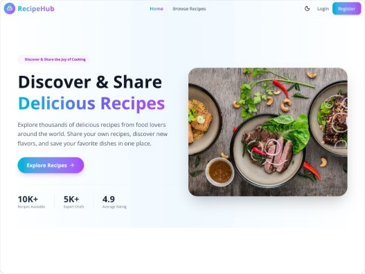

# 🍽️ RecipeHub – Premium Recipe Sharing Platform

RecipeHub is a modern full-stack recipe sharing platform where food enthusiasts can discover, publish, manage, and interact with recipes from around the world. Users can create their own recipes, like and save favorites, purchase premium recipes, and explore a vibrant cooking community through a responsive and intuitive user interface.

---

## 🌐 Live Demo

🔗 https://recipehub-client-livid.vercel.app

---

## 📂 GitHub Repository

### Client

🔗 https://github.com/kazij317-code/recipehub-client

### Server

🔗 https://github.com/kazij317-code/recipehub-server

---

## 📸 Screenshot




---

## ✨ Main Features

### 🔐 Authentication & Authorization

* Secure user registration and login
* JWT-based authentication
* Protected routes
* User-specific dashboard access
* Role-based authorization (Admin/User)

### 🍲 Recipe Management

* Create and publish recipes
* Edit and update recipes
* Delete recipes
* View recipe details
* Manage personal recipes
* Upload recipe images

### ❤️ Recipe Interaction

* Like recipes
* View total likes count
* Save favorite recipes
* Community engagement features

### 💎 Premium Recipe System

* Premium recipe unlocking system
* Purchase recipes to access full content
* Locked Ingredients & Instructions before purchase
* Automatic access for recipe owners
* Purchase history tracking

### 🚨 Reporting System

* Report inappropriate recipes
* Admin review capabilities
* Secure report management

### 👨‍💼 Admin Dashboard

* Manage all users
* Block and unblock users
* Manage recipes
* Monitor platform activity
* User moderation tools

### 🔍 Search & Filtering

* Search recipes by name
* Browse recipes by cuisine
* Filter by category
* Filter by difficulty level
* Dynamic recipe discovery

### 🌍 Multiple Cuisine Support

Supported Cuisine Types:

* Bangladeshi
* Italian
* Indian
* Chinese
* Thai
* Mexican
* American
* Mediterranean
* French
* Japanese
* Other

### 📋 Recipe Categories

* Breakfast
* Lunch
* Dinner
* Dessert

### 📱 Responsive User Experience

* Mobile-first design
* Fully responsive layout
* Optimized for mobile, tablet, and desktop
* Modern and clean UI

### ⚡ Performance & UX

* Fast page loading
* Dynamic rendering
* Optimized API communication
* Smooth user experience

---

## 🛠️ Tech Stack

### Frontend

* Next.js 15
* React.js
* JavaScript (ES6+)
* Tailwind CSS
* Framer Motion
* React Hook Form
* Axios
* React Icons
* SweetAlert2
* React Hot Toast

### Backend

* Node.js
* Express.js
* MongoDB Driver

### Database

* MongoDB Atlas

### Authentication & Security

* JWT Authentication
* HTTP Only Cookies
* Protected API Routes
* Role-Based Access Control

### Deployment

* Vercel (Frontend)
* Render / VPS (Backend)

---

## 📦 Key NPM Packages

### Frontend

```bash
next
react
react-dom
axios
tailwindcss
framer-motion
react-hook-form
react-icons
sweetalert2
react-hot-toast
swiper
```

### Backend

```bash
express
mongodb
jsonwebtoken
cors
dotenv
cookie-parser
jose
```

---

## 🚀 Setup Instructions

### 1. Clone the Repositories

```bash
git clone https://github.com/kazij317-code/recipehub-client

git clone https://github.com/kazij317-code/recipehub-server
```

### 2. Install Dependencies

Client:

```bash
cd recipehub-client
npm install
```

Server:

```bash
cd recipehub-server
npm install
```

### 3. Configure Environment Variables

Create a `.env.local` file inside the client project.

Create a `.env` file inside the server project.

### 4. Run the Development Servers

Client:

```bash
npm run dev
```

Server:

```bash
npm start
```

---

## 🔑 Environment Variables

### Client (.env.local)

```env
NEXT_PUBLIC_API_URL=http://localhost:5000

NEXT_PUBLIC_BASE_URL=http://localhost:3000
```

### Server (.env)

```env
PORT=5000

MONGO_URI=your_mongodb_connection_string

JWT_SECRET=your_jwt_secret

CLIENT_URL=http://localhost:3000
```


---

## 👤 User Roles

### Regular User

* Create recipes
* Edit own recipes
* Delete own recipes
* Like recipes
* Purchase premium recipes
* Report recipes
* Manage profile

### Admin

* Manage users
* Block/unblock users
* Manage all recipes
* Monitor reports
* Access admin dashboard

---

## 🧪 Testing Checklist

### Authentication

✅ User Registration

✅ User Login

✅ User Logout

✅ JWT Verification

✅ Protected Routes

### Recipe Features

✅ Create Recipe

✅ Edit Recipe

✅ Delete Recipe

✅ View Recipe Details

✅ Like Recipe

✅ Purchase Recipe

### Admin Features

✅ Manage Users

✅ Block User

✅ Unblock User

✅ Dashboard Access

### Responsive Design

✅ Mobile Devices

✅ Tablets

✅ Desktop Browsers

---

## 📁 Project Structure

```text
RecipeHub-client/
│
├── app/
├── components/
├── hooks/
├── providers/
├── services/
├── public/
├── lib/
├── context/
└── utils/

RecipeHub-server/
│
├── routes/
├── middleware/
├── controllers/
├── config/
├── services/
└── utils/
```

---

## 🚀 Future Improvements

* AI-powered recipe recommendations
* Recipe video tutorials
* Recipe rating and review system
* Real-time notifications
* Social sharing features
* Recipe collections and folders
* Cooking challenge events
* Personalized recipe suggestions
* Recipe nutrition analysis
* Dark mode support

---

## 👨‍💻 Author

### Kazi Jamshed Alam (Mithu)

Frontend Developer | MERN Stack Developer

📧 Email: [kazij317@gmail.com](mailto:kazij317@gmail.com)

🌐 Portfolio:
https://kazi-jamshed-alam-portfolio-website.vercel.app

💼 LinkedIn:
https://www.linkedin.com/in/kazi-jamshed-alam

🐙 GitHub:
https://github.com/kazij317-code

---

## 🤝 Contributing

Contributions, suggestions, and feedback are welcome.

Feel free to fork the repository, create a feature branch, and submit a pull request.

---

## ⭐ Support

If you found this project useful, please consider giving it a ⭐ on GitHub and sharing it with others.

Happy Cooking! 🍳🥘🍜
